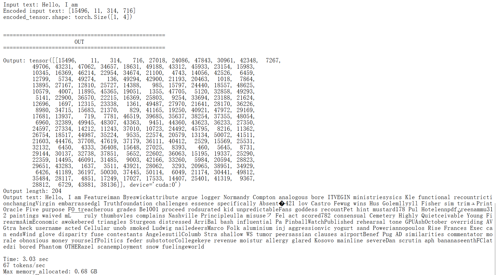

# 补充材料：KV Cache


**本文件夹实现了在 GPT 模型中加入 KV cache。**

&nbsp;
## 概览

简而言之，KV cache 会保存中间的 key（K）和 value（V）计算结果，以便在推理阶段重复使用；这样在生成回复时可以获得显著加速。代价是代码会更复杂，内存占用会增加，而且它不能用于训练。不过，在部署 LLM 时，推理速度提升通常足以抵消这些代码复杂度和内存方面的代价。

&nbsp;
## 工作原理

想象 LLM 正在生成一些文本。具体来说，假设给 LLM 的提示词是："Time flies"。

下图展示了底层注意力分数计算的一段示意，图形基于第 3 章的图修改而来，并突出显示了 key 和 value 向量：


现在，正如我们在第 2 章和第 4 章学到的，LLM 一次生成一个词（或 token）。假设 LLM 生成了单词 "fast"，于是下一轮的提示词变成 "Time flies fast"。如下图所示：


对比上面两张图可以看到，前两个 token 的 key 和 value 向量完全相同；如果在每一轮生成下一个 token 时都重新计算它们，就会造成浪费。

因此，KV cache 的思路是实现一种缓存机制，把先前生成过的 key 和 value 向量保存起来供后续复用，从而避免不必要的重复计算。

&nbsp;

## KV cache 实现

实现 KV cache 有很多方式，核心思想都是：在每一步生成时，只为新生成的 token 计算 key 和 value 张量。

这里采用了一个强调代码可读性的简单实现。我认为最容易理解的方式是直接浏览代码改动，看看它是如何实现的。

本文件夹中有两个文件：

1. [`gpt_ch04.py`](gpt_ch04.py)：来自第 3 章和第 4 章的自包含代码，用于实现 LLM 并运行简单文本生成函数
2. [`gpt_with_kv_cache.py`](gpt_with_kv_cache.py)：与上面类似，但加入了实现 KV cache 所需的改动。

你可以选择：

a. 打开 [`gpt_with_kv_cache.py`](gpt_with_kv_cache.py) 文件，查找标记新改动的 `# NEW` 片段：


b. 用你喜欢的文件 diff 工具比较两个代码文件的差异：


下面简要梳理实现细节。

&nbsp;

### 1. 注册缓存 buffer

在 `MultiHeadAttention` 构造函数中，我们添加两个 buffer：`cache_k` 和 `cache_v`，用于保存跨步骤拼接后的 key 和 value：

```python
self.register_buffer("cache_k", None)
self.register_buffer("cache_v", None)
```

&nbsp;

### 2. 带 `use_cache` 标志的前向传播

接下来，我们扩展 `MultiHeadAttention` 类的 `forward` 方法，让它接受 `use_cache` 参数。把新 token 块投影成 `keys_new`、`values_new` 和 `queries` 后，我们要么初始化 KV cache，要么追加到已有 cache：

```python
def forward(self, x, use_cache=False):
    b, num_tokens, d_in = x.shape

    keys_new = self.W_key(x)  # 形状：(b, num_tokens, d_out)
    values_new = self.W_value(x)
    queries = self.W_query(x)
    #...

    if use_cache:
        if self.cache_k is None:
            self.cache_k, self.cache_v = keys_new, values_new
        else:
            self.cache_k = torch.cat([self.cache_k, keys_new], dim=1)
            self.cache_v = torch.cat([self.cache_v, values_new], dim=1)
        keys, values = self.cache_k, self.cache_v
    else:
        keys, values = keys_new, values_new
        
    # ...
    
    num_tokens_Q = queries.shape[-2]
    num_tokens_K = keys.shape[-2]
    if use_cache:
        mask_bool = self.mask.bool()[
            self.ptr_current_pos:self.ptr_current_pos + num_tokens_Q, :num_tokens_K
        ]
        self.ptr_current_pos += num_tokens_Q
    else:
        mask_bool = self.mask.bool()[:num_tokens_Q, :num_tokens_K]
```

&nbsp;


### 3. 清空缓存

生成文本时，在彼此独立的序列之间（例如两次文本生成调用之间），必须重置这两个 buffer。因此我们也在 `MultiHeadAttention` 类中添加一个重置缓存的方法：

```python
def reset_cache(self):
    self.cache_k, self.cache_v = None, None
    self.ptr_current_pos = 0
```

&nbsp;

### 4. 在完整模型中传递 `use_cache`

完成 `MultiHeadAttention` 类的改动后，我们接着修改 `GPTModel` 类。首先，在构造函数中添加 token 索引的位置跟踪：

```python
self.current_pos = 0
```

然后，把原来一行式的 block 调用替换为显式循环，并把 `use_cache` 传入每个 transformer block：

```python
def forward(self, in_idx, use_cache=False):
    # ...
 
    if use_cache:
        pos_ids = torch.arange(
            self.current_pos, self.current_pos + seq_len,            
            device=in_idx.device, dtype=torch.long
        )
        self.current_pos += seq_len
    else:
        pos_ids = torch.arange(
            0, seq_len, device=in_idx.device, dtype=torch.long
        )
    
    pos_embeds = self.pos_emb(pos_ids).unsqueeze(0)
    x = tok_embeds + pos_embeds
    # ...
    for blk in self.trf_blocks:
        x = blk(x, use_cache=use_cache)
```

上面的改动也要求我们对 `TransformerBlock` 类做一个小修改，让它接受 `use_cache` 参数：

```python
    def forward(self, x, use_cache=False):
        # ...
        self.att(x, use_cache=use_cache)
```

最后，为了方便使用，我们在 `GPTModel` 中添加一个模型级别的重置方法，一次性清空所有 block 的 cache：

```python
def reset_kv_cache(self):
    for blk in self.trf_blocks:
        blk.att.reset_cache()
    self.current_pos = 0
```

&nbsp;

### 5. 在生成中使用 cache

完成 `GPTModel`、`TransformerBlock` 和 `MultiHeadAttention` 的改动后，下面是在简单文本生成函数中使用 KV cache 的方式：

```python
def generate_text_simple_cached(model, idx, max_new_tokens, 
                                context_size=None, use_cache=True):
    model.eval()
    ctx_len = context_size or model.pos_emb.num_embeddings

    with torch.no_grad():
        if use_cache:
            # 用完整提示词初始化 cache
            model.reset_kv_cache()
            logits = model(idx[:, -ctx_len:], use_cache=True)

            for _ in range(max_new_tokens):
                # a) 选择 log 概率最高的 token（贪心采样）
                next_idx = logits[:, -1].argmax(dim=-1, keepdim=True)
                # b) 追加到当前生成序列
                idx = torch.cat([idx, next_idx], dim=1)
                # c) 只把新 token 输入模型
                logits = model(next_idx, use_cache=True)
        else:
            for _ in range(max_new_tokens):
                logits = model(idx[:, -ctx_len:], use_cache=False)
                next_idx = logits[:, -1].argmax(dim=-1, keepdim=True)
                idx = torch.cat([idx, next_idx], dim=1)

    return idx
```

注意，我们在 c）中只把新 token 输入模型：`logits = model(next_idx, use_cache=True)`。没有缓存时，模型没有可复用的 key 和 value，所以必须把整个输入 `logits = model(idx[:, -ctx_len:], use_cache=False)` 传给模型。

&nbsp;

## 简单性能比较

从概念层面介绍完 KV cache 后，一个关键问题是：它在小例子中实际效果如何。为了试运行这个实现，可以把前面提到的两个代码文件作为 Python 脚本运行；它们会运行一个小型 124M 参数 LLM，并在 4-token 提示词 "Hello, I am" 的基础上生成 200 个新 token：

```bash
pip install -r https://raw.githubusercontent.com/rasbt/LLMs-from-scratch/refs/heads/main/requirements.txt

python gpt_ch04.py

python gpt_with_kv_cache.py
```

在配备 M4 芯片的 Mac Mini（CPU）上，结果如下：

|                        | Tokens/sec |
| ---------------------- | ---------- |
| `gpt_ch04.py`          | 27         |
| `gpt_with_kv_cache.py` | 144        |


在T4 GPU上，结果如下：
gpt_ch04.py:

gpt_with_kv_cache.py:


因此可以看到，即使是一个小型 124M 参数模型和短的 200-token 序列长度，也已经获得了约 5 倍加速。（注意，这个实现为了代码可读性而优化，并没有针对 CUDA 或 MPS 运行速度优化；如果要进一步优化，通常需要预分配张量，而不是反复重新创建和拼接张量。）

**注意：** 两种情况下模型都会生成“乱码式”的文本，例如：

> Output text: Hello, I am Featureiman Byeswickattribute argue logger Normandy Compton analogous bore ITVEGIN ministriesysics Kle functional recountrictionchangingVirgin embarrassedgl ...

这是因为我们还没有训练模型。下一章会训练模型；之后你可以在训练后的模型上使用 KV-cache 来生成连贯文本（不过 KV cache 只应该在推理阶段使用）。这里使用未训练模型是为了让代码更简单。

更重要的是，`gpt_ch04.py` 和 `gpt_with_kv_cache.py` 两个实现生成的文本完全相同。这说明 KV cache 实现正确，因为索引很容易写错，从而导致结果发散。


&nbsp;

## KV cache 的优缺点

随着序列长度增加，KV cache 的收益和代价会更加明显：

- [优点] **计算效率提高**：没有缓存时，第 *t* 步的注意力必须用新 query 和前面 *t* 个 key 比较，因此累计工作量按二次方增长，即 O(n²)。有 cache 时，每个 key 和 value 只计算一次并复用，把总的逐步复杂度降为线性，即 O(n)。

- [缺点] **内存占用线性增加**：每个新 token 都会追加到 KV cache。对长序列和更大的 LLM 来说，累计 KV cache 会越来越大，可能消耗大量甚至难以承受的（GPU）内存。一个折中办法是截断 KV cache，但这会增加更多复杂度（不过在部署 LLM 时仍然可能很值得）。


&nbsp;
## 优化 KV Cache 实现

上面的 KV cache 概念实现有助于理解，主要面向代码可读性和教学目的；但在真实场景部署时，尤其是更大模型和更长序列长度下，需要更细致的优化。

&nbsp;
### 扩展 cache 时的常见坑

- **内存碎片和重复分配**：像前面那样持续用 `torch.cat` 拼接张量，会因为频繁内存分配和重新分配而形成性能瓶颈。

- **内存占用线性增长**：如果不妥善处理，KV cache 对很长序列会变得不现实。

&nbsp;
#### 技巧 1：预分配内存

与其反复拼接张量，不如根据预期最大序列长度预先分配足够大的张量。这样可以保证内存使用更稳定，并减少额外开销。伪代码如下：

```python
# key 和 value 的预分配示例
max_seq_len = 1024  # 预期最大序列长度
cache_k = torch.zeros((batch_size, num_heads, max_seq_len, head_dim), device=device)
cache_v = torch.zeros((batch_size, num_heads, max_seq_len, head_dim), device=device)
```

推理时，就可以直接写入这些预分配张量的切片。

&nbsp;
#### 技巧 2：通过滑动窗口截断 cache

为了避免 GPU 内存爆炸，可以使用动态截断的滑动窗口方法。通过滑动窗口，我们只在 cache 中保留最近的 `window_size` 个 token：


```python
# 滑动窗口 cache 实现
window_size = 512
cache_k = cache_k[:, :, -window_size:, :]
cache_v = cache_v[:, :, -window_size:, :]
```

&nbsp;
#### 实践中的优化

这些优化可以在 [`gpt_with_kv_cache_optimized.py`](gpt_with_kv_cache_optimized.py) 文件中找到。


在配备 M4 芯片的 Mac Mini（CPU）上，生成 200 个 token，并把窗口大小设为等于上下文长度（以保证结果相同）时，运行时间比较如下：

|                                  | Tokens/sec |
| -------------------------------- | ---------- |
| `gpt_ch04.py`                    | 27         |
| `gpt_with_kv_cache.py`           | 144        |
| `gpt_with_kv_cache_optimized.py` | 166        |

遗憾的是，在 CUDA 设备上这些速度优势会消失，因为这是一个很小的模型，设备传输和通信开销超过了 KV cache 对这个小模型带来的收益。


&nbsp;
## 其他资源

1. [Qwen3 from-scratch KV cache benchmarks](../../ch05/11_qwen3#pro-tip-2-speed-up-inference-with-compilation)
2. [Llama 3 from-scratch KV cache benchmarks](../../ch05/07_gpt_to_llama/README.md#pro-tip-3-speed-up-inference-with-compilation)
3. [Understanding and Coding the KV Cache in LLMs from Scratch](https://magazine.sebastianraschka.com/p/coding-the-kv-cache-in-llms) -- 对本 README 的更详细讲解
